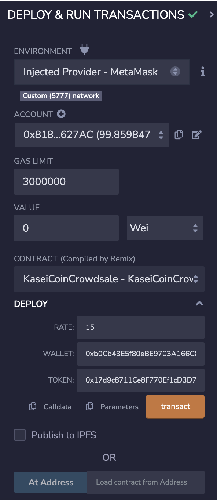
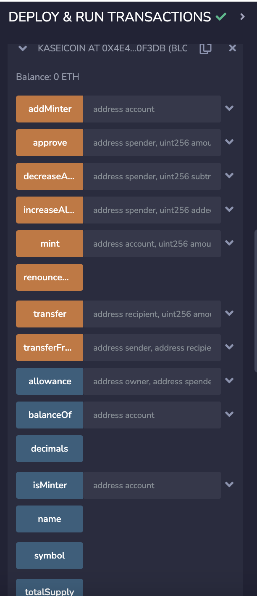
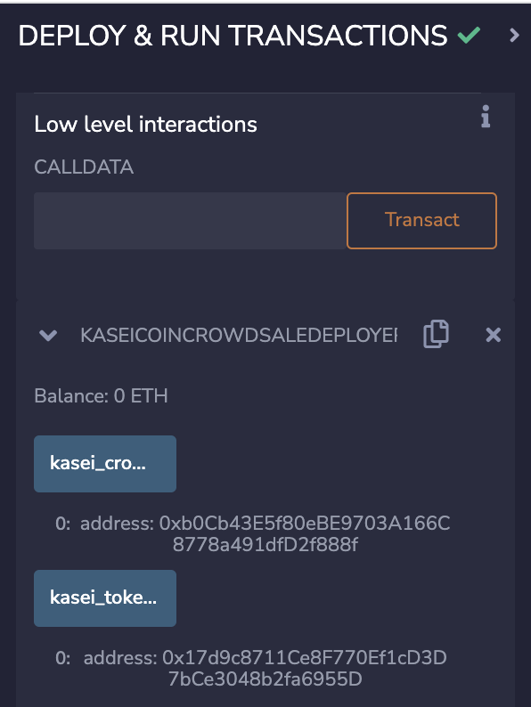
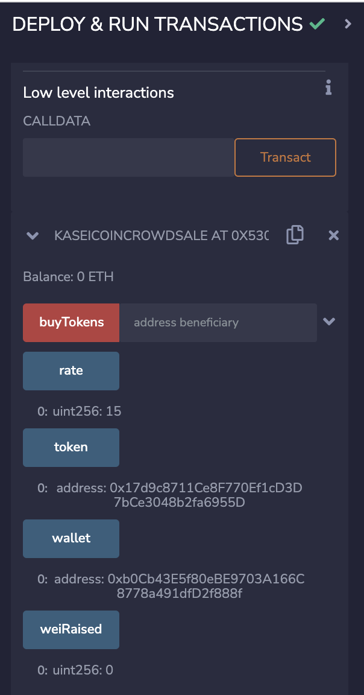

# Token Crowdsale

## Background

After waiting for years and passing several tests, the Martian Aerospace Agency selected you to become part of the first human colony on Mars. As a prominent fintech professional, they chose you to lead a project developing a monetary system for the new Mars colony. You decided to base this new system on blockchain technology and to define a new cryptocurrency named **KaseiCoin**. (Kasei means Mars in Japanese.)

KaseiCoin will be a fungible token that’s ERC-20 compliant. You’ll launch a crowdsale that will allow people who are moving to Mars to convert their earthling money to KaseiCoin.

## Instructions

Using Remix is how well deploy this coin. To deploy you must first deploy the KaseiCoin.sol contract, secondly will be the KaseiCoinCrowdsaleDeploy contract and finally the KaseiCoinCrowdsale will need to be deployed.  

Once all three contracts are deployed you will enter in the relevant addresses into each field to generate transactions. You can see screenshots of each deployment in this README.

